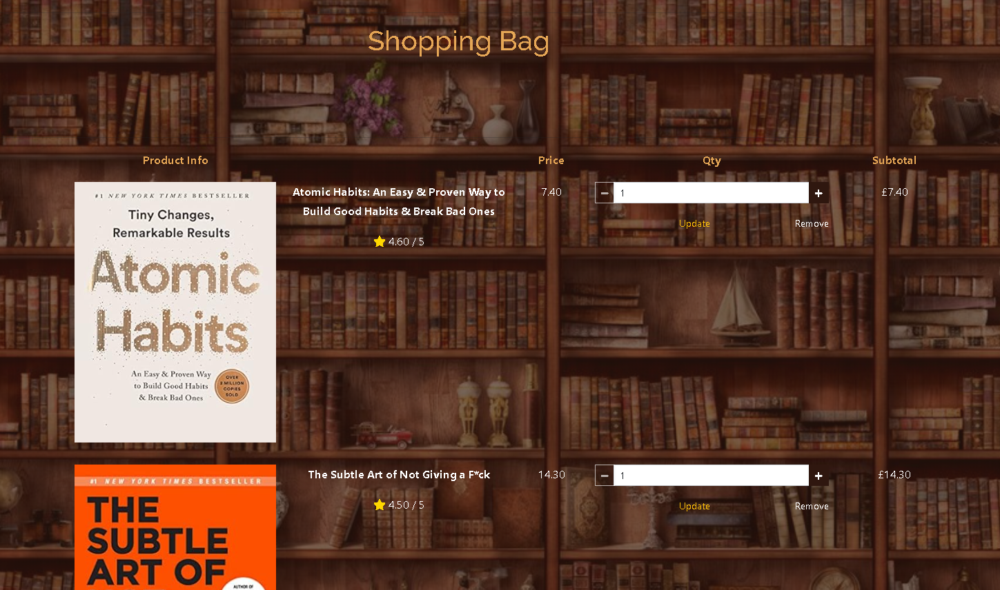

# nQueue

## Milestone Project 4 - Full Stack Development

<h2 align="center"></h2>

My milestone Project 4 is a fully functional online bookstore dedicated exclusively to self-development books. This fictional e-commerce platform offers a wide selection of titles focused on personal growth, mental wellness, productivity, and motivation. The store provides an intuitive and seamless shopping experience, allowing users to browse, search, and purchase books effortlessly.

## Live Project

[View the live project here.](https://nqueuebookstore-234df69c8477.herokuapp.com/)

## Repository

[Find the project repository here.](https://github.com/EdgarKlavins/nQueue)

# UX

### Desciption

The main purpose of this project is to create a full stack website with django including stripe payments, designed to browse, search and buy books.

## Project Goals
<ul>
    <li>To design and build a realworld Full Stack MVC application with a Front end</li>
    <li>To implement simple and clean design that is easy to navigate
    and allows the user to find information and resources intuitively.
    </li>
    <li>Where the purpose is immediately evident to a new user</li>
    <li>Which provides a good solution to the user’s demands and expectations</li>
    <li>To create a good looking website that responds correctly on all device sizes.</li>
    <li>A website that has user authentication</li>
    <li>A website that has user uuthorization</li>
    <li>A website is providing CRUD operations where all data (CRUD)
    actions are immediately reflected in the user interface.
    </li>
    <li>A website which is linked to external database</li>
    <li>Configure the project efficiently through wellkept Procfile, requirements.txt file,
    settings files, keeping the data store configuration in a single location where it can be changed easily.
    </li>
    <li> Fully describe the data schema in the project README file.</li>
    <li> Demonstrate solid understanding of Django template syntax, logic and usage</li>
    <li> Use version control software effectively to provide a record of the development process.</li>
</ul>
 

## User Stories

### As a Customer:
1. **Account Creation:**
   - As a customer, I want to create an account so that I can manage my orders and personal information.
   
2. **Login and Logout:**
   - As a customer, I want to log in to my account so that I can access my personal dashboard and order history.
   - As a customer, I want to log out of my account so that my personal information remains secure.

3. **Browse Books:**
   - As a customer, I want to browse through the book categories so that I can find books that interest me.
   
4. **Search Books:**
   - As a customer, I want to search for books by title, author, or keyword so that I can quickly find specific books I am looking for.
   
5. **Book Details:**
   - As a customer, I want to view detailed information about a book, including its description, author, and ratings, so that I can make an informed purchase decision.
   
6. **Add to Cart:**
   - As a customer, I want to add books to my shopping cart so that I can purchase multiple items at once.
   
7. **Manage Cart:**
   - As a customer, I want to view, update, and remove items from my shopping cart so that I can manage my intended purchases.
   
8. **Checkout:**
   - As a customer, I want to securely enter my payment information and complete the purchase process so that I can buy the books I want.
   
9. **Order Confirmation:**
   - As a customer, I want to receive an order confirmation email so that I have a record of my purchase.

10. **Order History:**
    - As a customer, I want to view my past orders so that I can keep track of my purchases.

### As a Visitor:
1. **Explore Website:**
   - As a visitor, I want to browse the website without creating an account so that I can explore the available books.
   
2. **Search Books:**
   - As a visitor, I want to search for books by title, author, or keyword so that I can find books that interest me.
   
3. **Book Details:**
   - As a visitor, I want to view detailed information about a book so that I can learn more about it before deciding to purchase.

4. **Create an Account:**
   - As a visitor, I want to create an account so that I can save my favorite books and make future purchases.

### As a Site Owner:
1. **Manage Books:**
   - As a site owner, I want to add, update, and remove books from the catalog so that I can keep the inventory current and accurate.
   
2. **View Orders:**
   - As a site owner, I want to view customer orders so that I can fulfill them efficiently.

3. **Manage Users:**
   - As a site owner, I want to manage user accounts, including registration and permissions, so that I can maintain the security and integrity of the site.

 

## Design

   ### Wireframes

   1. **Home page** displays the introduction and purpose of the website.

   [Home page](docs/README/wireframes/homew.png)

   2. **Books** displays list of products.

   [Books page](docs/README/wireframes/Products.png)

   3. **Product desciption** displays details of the products, gives option to add to bag.

   [Details page](docs/README/wireframes/description.png)

   4. **Shopping bag** displays details of the products, gives option to add to bag.

   [Shoping bag](docs/README/wireframes/Shoping_bag.png)

  

 ### Colour Scheme

 - For my project I used a  colour scheme of warm browns, greys and yellows. I chosed colors to match the main bacground theme with books.

 <h2 align="center"></h2>

  

 ### Typography

 - As Google fonts I have picked two fonts.

 

 1.  <h2 align="center"></h2>

 2. <h2 align="center"></h2>

  

 ### Imagery 

 For my main bacground image, to create smart, classical atmosphere, I used Old Vintage Bookshelf from https://www.freepik.com/

 <h2 align="center"></h2>

 And open book image at my homepage from https://www.shutterstock.com/

 <h4 align="center"></h4>

 Rest of images for my product list are takken directly from www.amazon.co.uk books as url_images.

  

 ### Icons

 All icons through out the website are imported from Font Awesome

 #### Main Navigation

 * Search Icon: Used in the search bar within the header section.
 * Shopping Bag Icon: Displayed in the navigation bar to represent the shopping bag.
 * Footer section for Facebook profile, LinkedIn profile,  Instagram profile and GitHub profile

 #### Bag

 * Star Icon: Displayed next to product ratings.
 * Minus and Plus Icon: Used in the decrement and increment quantity button.
 * Chevron Left Icon: Used in the "Keep Shopping" button. 
 * Lock Icon: Used in the "Secure Checkout" button. 

  

# Features

 ### Header 

  

    
<b>See Header</b>

   
   
  

   
 
 The header sets the tone and branding of the website containing:

  * Main Title: Displays "nQueue - Personal Development Books", reinforcing the website's focus.
  * Tagline: "Invest in yourself", encouraging users to see the value in personal development books.
  * Search Bar, features an input field and a search button styled to match the site's design and allows users to search for books by entering keywords.

  

    
<b>See Search bar</b>

   
   
  

   

 ### Navigation Bar

 

    
<b>See Navigation bar</b>

   
   
  

   

 The navigation bar provides a user-friendly, responsive  interface to navigate through the website and contain:
  
  * Home, which links directly to the homepage, allowing users to easily return to the starting point of the website.

  * Books, dropdown menu that offers several options:

      

         
<b>See Books dropdown menu</b>

      
         
      

  

     *  All Books: Links to a page displaying all available books.
     *  By Rating: Sorts and displays books by their rating in descending order, helping users find the highest-rated books.
     *  By Price: Sorts and displays books by their price in ascending order, assisting users in finding budget-friendly options.

   * Genre, dropdown menu categorizing books into different genres:

       

         
<b>See Genre dropdown menu</b>

      
         
      

      
     * Motivational & Inspirational: Links to books that inspire and motivate.
     * Self-help: Links to books focusing on personal development and self-improvement.
     * Spirituality: Links to books exploring spiritual topics.
     * Personal Finance: Links to books providing financial advice and strategies.
     * Biography: Links to biographies of influential individuals.

   * Best Sellers, direct link to a page showcasing the best-selling books, helping users quickly find popular and recommended reads.

   * My Account, dropdown menu that changes based on the user's authentication status
     * Authenticated Users:
         

         
<b>See My account dropdown menu</b>

          
          
         
          

        * Product Management: Available only for superusers, linking to a page where products can be managed (added, edited, deleted).
        * My Profile: Links to the user’s profile page, allowing them to view and edit their personal information.
        * Logout: Provides a logout option to end the user's session.

     * Unauthenticated Users:
         

         
<b>See My account dropdown menu</b>

          
          
         
          

        * Register: Links to the registration page for new users to sign up.
        * Login: Links to the login page for existing users to access their accounts.

    

   * Shopping Bag, a dynamic link displaying the total cost of items in the user’s shopping bag. Including:
      

      
<b>See Shoping bag</b>

            
      
            
      

      * Shopping Bag Icon: visual indicator of the shopping bag.
      * Total Amount: shows the current total price of the items in the bag.
      * Links to the shopping bag page where users can view and manage their selected items.

       

 ### Homepage Content

   * Introductory Section:
      

      
<b>See Introductory Section</b>

            
      
            
      

       * Includes a visually appealing image and motivational quotes.
       * Features a prominent button linking to the best sellers page.

   * Call-to-Action Section:
      

      
<b>See Call-to-Action Section</b>

            
      
            
      

       * Highlights key benefits such as same-day delivery in Birmingham for orders placed before 14:00 and free delivery on orders above a specified threshold.
    

   ### Footer
   

   
<b>See Footer Section</b>

            
   
            
   

   * Copyright Information:
       * Displays “© Nqueue 2024. Educational purposes only.”, indicating the website's educational intent and ownership.

   * Social Media Links, where each link is represented by the respective 
    social media icon for easy identification and access.

    

 ### Dynamic Messaging System/Toasts

   * Messages and Alerts: 
      * Utilizes Django's messaging framework to display real-time notifications.
      * Toast notifications for different message levels:
         * Error Messages: Displayed for critical issues or failed operations.
         * Warning Messages: Indicate potential issues or important notices.
         * Success Messages: Confirm successful operations.
         * Info Messages: Provide general information to users.

      

      
<b>See Toast</b>

      
      
   

    

 ### Product Listings
   
   * Product page

      

      
<b>See user view</b>

      
         
      

   * Displays all products in a grid format with each book presented in a 
        card.
   * Product Card Details:
      * Image: Thumbnail of the book cover.
      * Title: Book title, styled boldly for visibility.
      * Year: Year of publication.
      * Price: Cost of the book.
      * Rating: Average rating by critics displayed with a star icon.

   * For superusers, each product card includes links to edit or delete the 
    product, providing quick access to manage the inventory.
      
      

      
<b>See Admin view</b>

      
      
   

  

 ### Product Details Page
   
 Content
   * Product Image:
     * Displays the product image within a responsive container.
     * If the product has an image URL (product.image_url), it is displayed 
        as a clickable link with the image.
     * If the product does not have an image URL, a placeholder image (noimage.png) is displayed instead.

   * Product Details:
     * Name: The name of the product, styled prominently for visibility.
     * Bestseller Badge: If the product is marked as a bestseller (product. 
        best_seller), a badge indicating its status is displayed.
        

        
<b>See bestseller tag</b>

         
      
         

     * Description: Provides a brief description of the product.
     * Genre: Specifies the genre of the product.
     * Price: Indicates the price of the product.
     * Year: Displays the year of publication.
     * Rating: Shows the average rating of the product out of 5 stars, with  
       a gold-colored star icon for visual appeal.
   
   

   
<b>See details</b>

   
      
   

    

  * Admin options 
     * If the user is a superuser, additional administrative options are provided:
        * Edit Link: Links to the product editing page.
        * Delete Link: Allows the superuser to delete the product directly.
     

     
<b>See Admin details</b>

     
      
     

     

     
<b>See Edit details</b>

     
      
     

     

     
<b>See Update details</b>

     
      
     

      

   * Add to Bag Form, allows users to add the product to their shopping bag:
     * Quantity Input: Enables users to specify the quantity of the product they want to add to their bag.
     * Add to Bag Button: Submits the form to add the specified quantity of the product to the bag.
     * Keep Shopping Link: Takes users back to the products page to continue shopping.
   *  Hidden Field: Includes a hidden input field (redirect_url) to store the URL of the current page. 
      This ensures users are redirected back to the product details page 
      after adding the product to their bag.

       

 ### Shopping Bag Page

   * Bag Items:
     * If the bag contains items, they are displayed in a table format.
     * Each item row includes:
       * Product Image: Shows a thumbnail of the product image.
       * Product Name: Displays the name of the product.
       * Product Rating: Shows the average rating of the product out of 5 stars.
       * Product Price: Indicates the price of the product.
       * Quantity Input: Allows users to adjust the quantity of the product.
       * Update Button: Enables users to update the quantity of the product in the bag.
       * Remove Button: Allows users to remove the product from the bag.
       * Subtotal: Displays the subtotal price for the quantity of the product.

     * If the bag is empty, a message ("Your bag is empty.") is displayed to inform the user.

     

     
<b>See Shoping Bag</b>

     
     
      
     

     

     
<b>See Shoping Bag</b>

     
     
     
      
     

     

     
<b>See Empty Bag</b>

     
     
      
     

   * Total Prices, calculates and displays the following total prices:
     * Bag Total: Shows the total price of all items in the bag.
     * Delivery: Displays the delivery cost.
     * Grand Total: Shows the grand total, including both the bag total and delivery cost.
     * Free Delivery Reminder: If applicable, reminds users of the amount needed to qualify for free delivery.

   * Navigation Links, Includes navigation links to facilitate user actions:
     * Keep Shopping: Takes users back to the products page to continue shopping.
     * Secure Checkout: Redirects users to the secure checkout page to complete their purchase.

      

 ### User Authorization and Authentication

 All user authorization and authentication functionalities on this platform are managed by Django Allauth. 
 This comprehensive third-party application provides robust and secure mechanisms for user registration, login, logout, password management, and social account integration. By leveraging Django Allauth, we ensure a seamless, reliable, and secure user experience across all authentication-related processes.

 Django admin panel
  

   
<b>See Admin panel</b>

     
   
      
   

    

 ### Future Features

  1. User Reviews and Ratings
   * Allow users to leave reviews and ratings for products they have 
     purchased. This feature will include:
      * An average rating displayed on the product page.
      * A section for written reviews with user profiles and timestamps.
      * Admin moderation tools to manage reviews.

  2. Wishlist Functionality
   * Enable users to create and manage wishlists for products they are 
     interested in. Features might include:
      * Adding and removing items from the wishlist.
      * Viewing and sharing wishlists with friends or on social media.
      * Notifications when wishlist items go on sale.

   3. Multi-Language Support
   * Expand the platform to support multiple languages to cater to a 
      global audience. This will involve:
      * Translating all static text and product information.
      * Allowing users to switch languages easily via a dropdown menu.
      * Ensuring right-to-left language support where applicable.

         

 ## Database models

  Models Overview and Relationships

  1. Profiles Models
     * UserProfile: This model extends the default Django User model to include additional fields for storing default delivery information and maintaining order history.

   2. Products Models
     * Product: This model includes various details about a product, such as 
       genre, year, author, name, description, price, rating, and images.

   3. Checkout Models
      * Order: This model captures order details, including user profile, 
        delivery information, and costs.
      * OrderLineItem: Represents individual items within an order, linking 
        an order to specific products and quantities.

  Relationships 
   
   1. UserProfile and User:
     * UserProfile is linked to Django's User model using a One-to-One 
        relationship
   2. Product and Genre/Year/Author:
     * Product has Foreign Key relationships with Genre, Year, and Author to 
       categorize the product by genre, year, and author respectively
   3. Order and UserProfile:
     * Order is linked to UserProfile using a Foreign Key relationship, this 
       allows orders to be associated with a specific user profile, enabling tracking of order history.
   4. OrderLineItem and Order/Product:
     * OrderLineItem has Foreign Key relationships with Order and Product. 
       This structure allows each line item in an order to reference a specific product and quantity.

       <h2 align="center"></h2>

     

 

   
       

 

