 

# Testing

  ## Automatic testing

  ### Code validators

    

  1. **HTML** validated through W3C Markup Validation Service

      * Home page - no errors:
           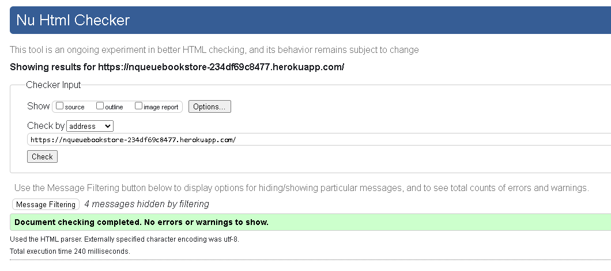

           

      * Products page - no errors:
            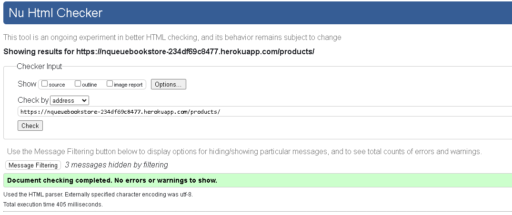

            

      * Profile page - no errors:
           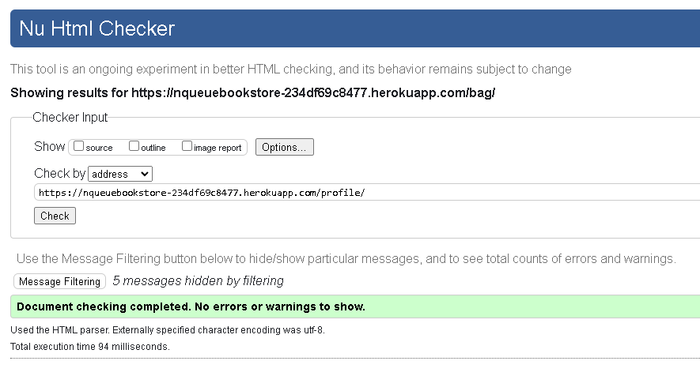

           

      * Bag page - no errors: 
           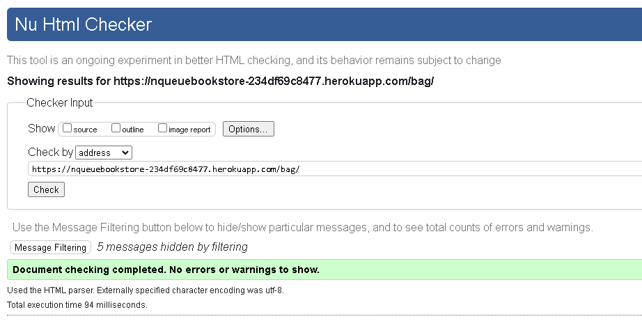

           

  2. **CSS** tested with W3C CSS Validator tool.
      
       * Home page - no errors:
           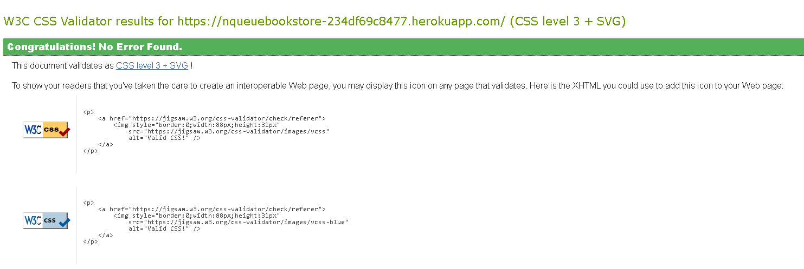

           

       * Products page - no errors:
            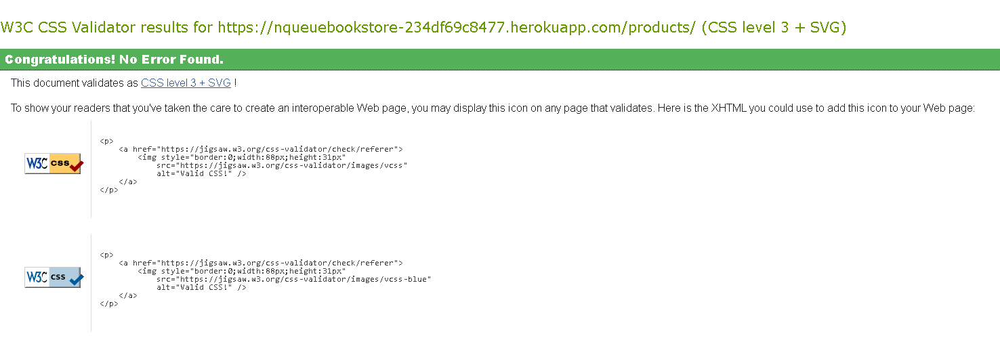

            

      * Profile page - no errors:
           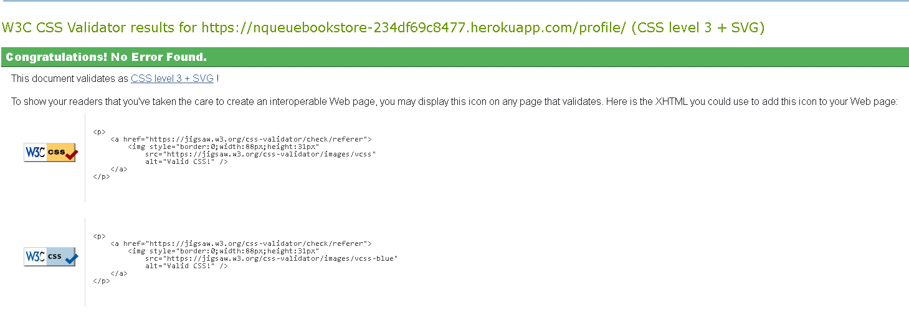

           

      * Bag page - no errors: 
           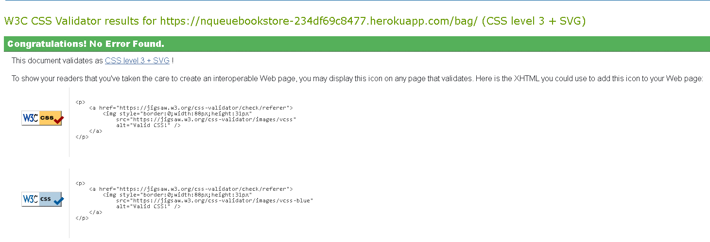

           

  3. **JSHINT Javascript Code Quality Tool**

       * Country selector for registry form:

         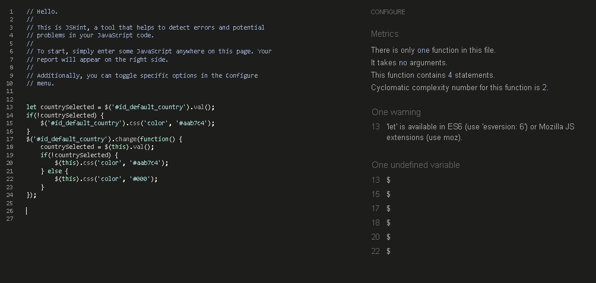

         

        * Increment/decrement script for bag:

         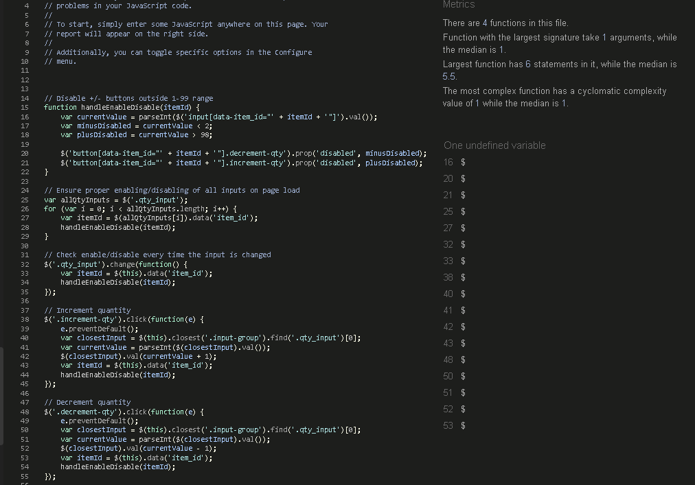

         

        * Stripe script:

         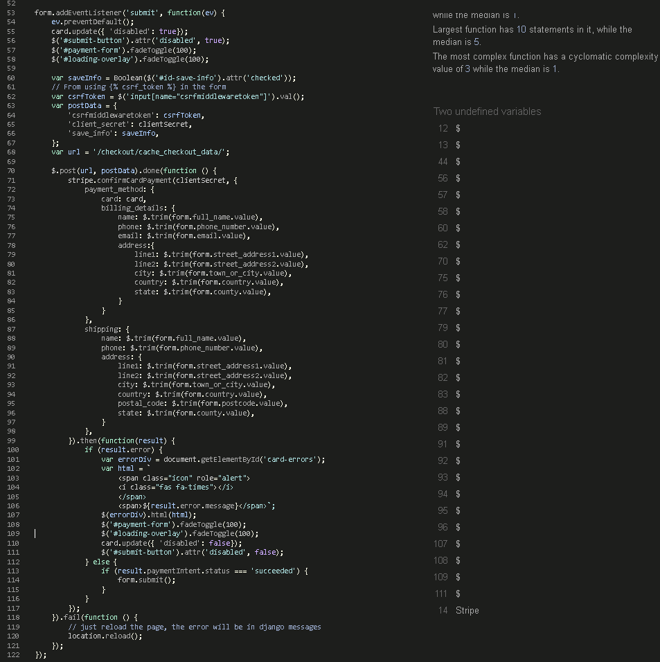

         

  4. **Python Validation using Gitpod**

        I have checked all Python documents using a PEP8 linter to ensure they are compliant.

         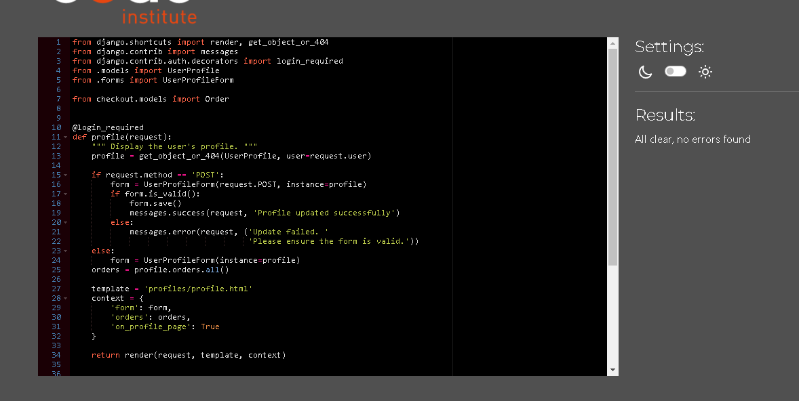

         

  ### Accessibility

    

 1. **Lighthouse**
  
    I used the Lighthouse reports in Google Developer Tools to examine the pages of the website for the following:

     * Performance
     * Accessibility
     * Best Practices
     * SEO

  

   Home page:
        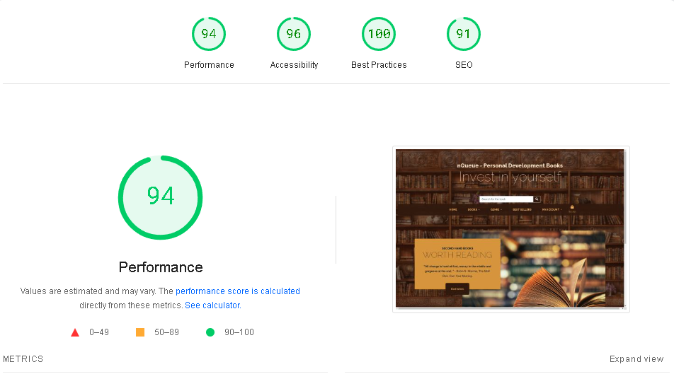

 

   Products page:
        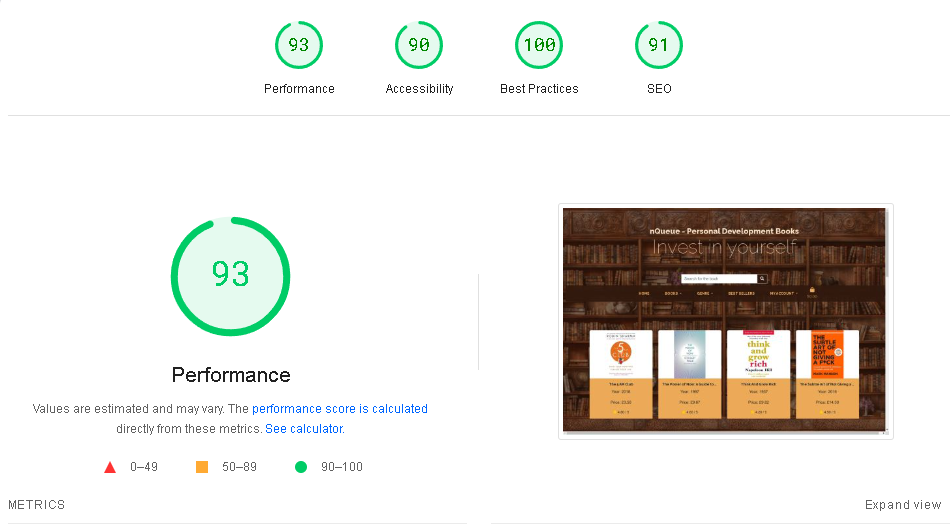

   Bag page:
        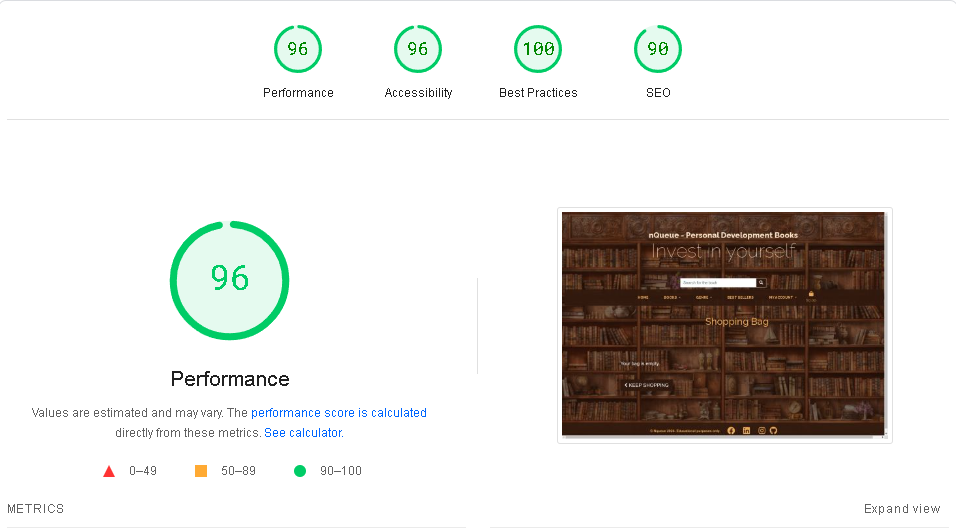

 2. **Wave Webaim Accessibility Checker** 
   
    I used WAVE Web Accessibility Evaluation Tools to verify the A11y compliance of my code. While there's room for enhancement, I've diligently worked to guarantee the accessibility of my website.

   

  Home page:
     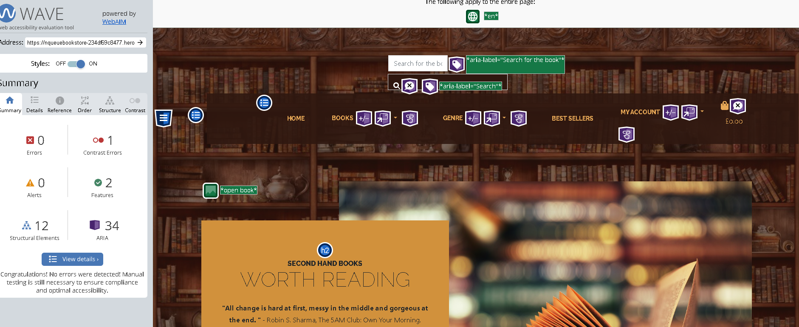

 

   Products page:
     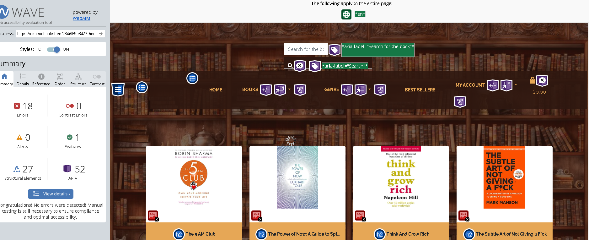

   Bag page:
     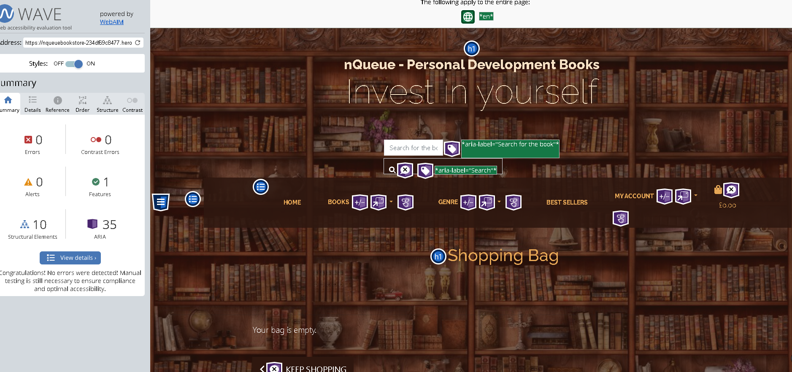

  

 In products page I have noticed bug, which is described in bug section

  

 ### Django Testing
 Extensive automated testing using Django TestCase. I have created several test cases, 
 which can be found in Products and Checkout tests.py

  

   Checkout tests.py

    

    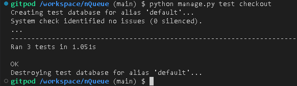

    

   Products tests.py

    

    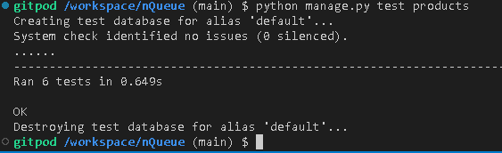

    

 ## Manual Testing
 ### Browser
 Each website has been tested on Google Chrome, Microsoft Edge, Firefox, and Samsung Internet Browser.

 | Feature tested \  On browser | Google Chrome | Microsoft Edge | Firefox | Samsung Internet  |
 | --- | --- | --- | --- | --- |
 | Works as intended | Yes | Yes | Yes | Yes |

 ### Devices
 Manually tested on mobile device (Xiaomi 12), tablet (Samsung Galaxy tab S4) laptop, and desktop computer.

 | Devices | Expected outcome / responsive | Pass / fail |
 | --- | --- | --- |
 | Mobile (Galaxy S21) | Looks as intended on this small screen size | Pass |
 | Tablet (Galaxy tab S3) | Looks as intended on this screen size | Pass |
 | Laptop (1366x768px) | Looks as intended on medium size screen | Pass |
 | Desktop (1920x1080px) | Looks as intended on big size screen | Pass |

 Notes:
 All testing was made on up-to-date browsers.

  

 ## User story testing
 ### As a Customer:
 1. **Account Creation:**
   - Positive Outcome: Customers can easily create an account, providing them with seamless access to order management features and personalized information.

 2. **Login and Logout:**
   - Positive Outcome: Customers can effortlessly log in to access their personal dashboard and order history, ensuring a convenient and secure browsing experience. They can also log out to safeguard their personal information.

 3. **Browse Books:**
   - Positive Outcome: Customers can explore various book categories, facilitating their search for books that match their interests and preferences.

 4. **Search Books:**
   - Positive Outcome: Customers can quickly find specific books by title, author, or keyword, streamlining their browsing experience and helping them discover desired books efficiently.

 5. **Book Details:**
   - Positive Outcome: Customers have access to comprehensive book details, including descriptions, author information, and ratings, empowering them to make informed purchasing decisions.

 6. **Add to Cart:**
   - Positive Outcome: Customers can effortlessly add books to their shopping cart, enabling them to conveniently collect items for purchase in a single transaction.

 7. **Manage Cart:**
   - Positive Outcome: Customers can easily view, update, and remove items from their shopping cart, ensuring flexibility and control over their intended purchases.

 8. **Checkout:**
   - Positive Outcome: Customers can securely enter payment information and complete the purchase process, facilitating smooth and hassle-free transactions for acquiring desired books.

 9. **Order Confirmation:**
   - Positive Outcome: Customers receive timely order confirmation emails, providing them with peace of mind and a documented record of their purchases.

 10. **Order History:**
    - Positive Outcome: Customers can conveniently access their past order history, allowing them to track their purchases and manage their reading preferences effectively.

 ### As a Visitor:
 1. **Explore Website:**
   - Positive Outcome: Visitors can freely explore the website's content and browse available books without the need to create an account, enhancing their browsing experience and encouraging further exploration.

 2. **Search Books:**
   - Positive Outcome: Visitors can efficiently search for books by various criteria, enabling them to discover books of interest and engage with the website's content effectively.

 3. **Book Details:**
   - Positive Outcome: Visitors can access detailed book information to learn more about specific titles, enhancing their browsing experience and facilitating informed decision-making.

 4. **Create an Account:**
   - Positive Outcome: Visitors have the option to create an account, enabling them to save favorite books and streamline future purchases, enhancing their engagement with the website.

 ### As a Site Owner:
 1. **Manage Books:**
   - Positive Outcome: Site owners can easily add, update, and remove books from the catalog, ensuring the inventory remains current and reflective of available stock.

 2. **View Orders:**
   - Positive Outcome: Site owners can efficiently view customer orders, allowing them to fulfill orders promptly and maintain high levels of customer satisfaction.

 3. **Manage Users:**
   - Positive Outcome: Site owners have robust user management capabilities, including registration and permissions management, enabling them to maintain site security and integrity effectively.

 ## Bugs
  

 Noticed issue when checked my products page with WAVE Web Accessibility Evaluation Tools, where it would not recognise alt text, due to django template language

  

  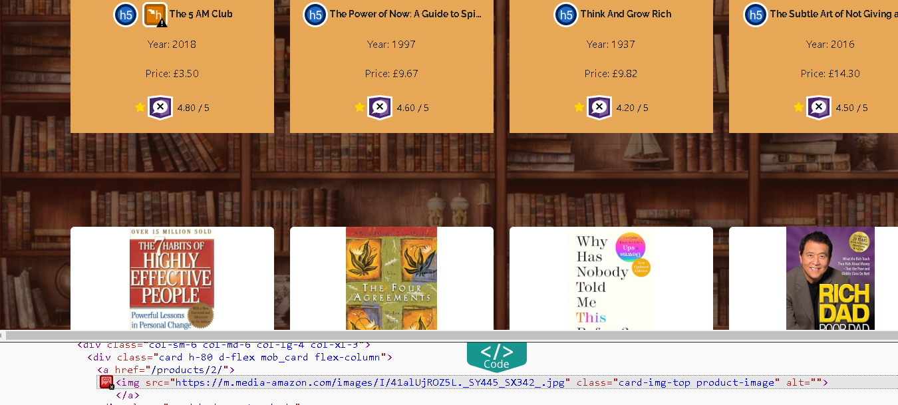

 As you see it shows empty

  

  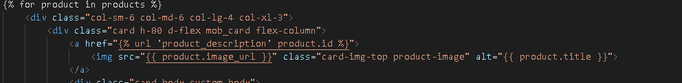

 And here as we can see alt field is used for {{ product.title }}, if image is not loaded.

  

 Another bug,  which is not affecting websites functionality is, when editing product through superuser options, it will give me in Author and Year section number as which it is saved in database, no actual Year or Name, so I have to enter them manualy each time if I press edit.
 I will try to sort that isssue in upcoming days

   

   

   

     

  

       

    

        

        
     

     